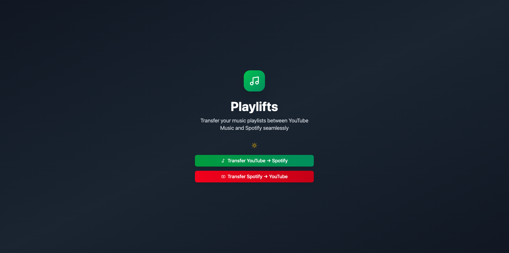
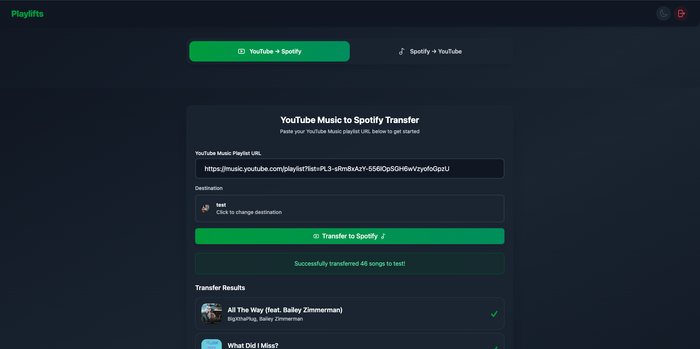
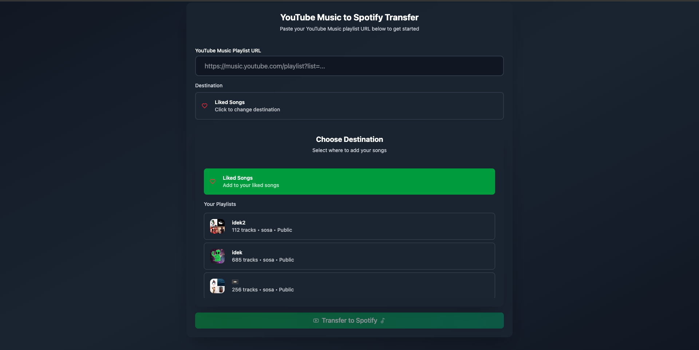
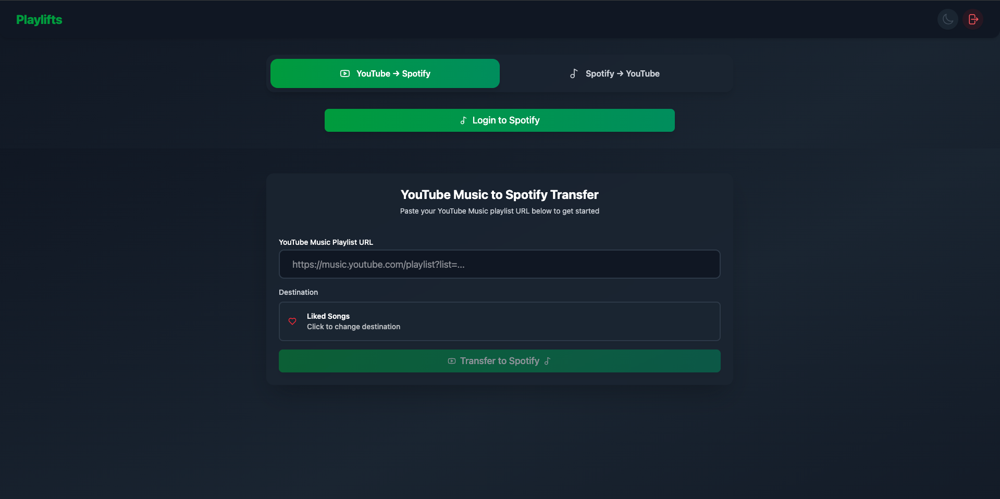

# Playlifts

Playlifts is a web application that allows users to transfer their music playlists between YouTube Music and Spotify.

**🌐 Live Application**: [playlifts.com](https://playlifts.com)  
**🔧 API Endpoint**: [api.playlifts.com](https://api.playlifts.com)



## Features

- **Bidirectional Transfer**: Transfer playlists from YouTube Music to Spotify and vice versa
- **Song Matching**: Intelligent matching between platforms using artist and track names
- **Large Playlist Support**: Handle playlists of any size through asynchronous processing
- **Real-time Progress**: Live progress tracking during transfers
- **Error Handling**: Comprehensive error reporting and retry mechanisms
- **Modern UI**: Beautiful, responsive interface with dark/light mode support
- **OAuth Integration**: Secure authentication with both platforms

## Tech Stack

### Frontend
- **React 18** 
- **TypeScript** 
- **Vite**
- **Tailwind CSS**
- **Framer Motion** 
- **React Router** 
- **Lucide React** 
- **React Testing Library** 

### Backend
- **Flask** 
- **Celery**
- **Redis** 
- **SQLAlchemy** 
- **MySQL** 
- **unittest** 

### Infrastructure
- **Docker** 
- **Docker Compose** 
- **Nginx** 
- **AWS EC2** 
- **Vercel** 

### APIs & Services
- **Spotify Web API** 
- **YouTube Data API** 
- **Google OAuth 2.0** 
- **Spotify OAuth 2.0** 

## Architecture

### Why Celery?

Processing playlists with hundreds of songs directly in API requests would cause timeouts. Both Spotify and YouTube APIs have rate limits that require careful pacing. Celery's asynchronous processing allows users to continue using the app while transfers happen in the background. Additionaly, failed transfers can be retried without affecting the user interface and multiple transfers can run concurrently without blocking each other.

### System Flow

1. **User Authentication**: OAuth 2.0 flow with Spotify and YouTube Music
2. **Playlist Selection**: Users browse and select source playlists
3. **Transfer Initiation**: Celery task is queued for processing
4. **Background Processing**: Songs are matched and transferred asynchronously
5. **Progress Updates**: Real-time status updates via WebSocket-like polling
6. **Completion**: Results are stored and displayed to the user

## Screenshots

### Login Experience

*Clean, modern login interface with dual authentication options*

### YouTube to Spotify Transfer

*Transferring playlists from YouTube Music to Spotify with real-time progress*

### Spotify Playlist Selection

*Browsing and selecting Spotify playlists for transfer*

### Authentication States

*Interface when user is only authenticated with Spotify*


*Interface when user is only authenticated with YouTube Music*

## Getting Started

### Prerequisites

- Python 3.9+
- Node.js 18+
- Docker and Docker Compose
- Redis server
- MySQL database

### Local Development Setup

#### 1. Clone the Repository
```bash
git clone https://github.com/esosaoh/playlifts.git
cd playlifts
```

#### 2. Backend Setup
```bash
cd backend
python -m venv venv
source venv/bin/activate  # On Windows: venv\Scripts\activate
pip install -r requirements.txt
```

#### 3. Environment Configuration
> 📖 **Backend Configuration**: See [backend/README.md](backend/README.md) for detailed environment variables and API setup instructions.

Create `.env` files in both `backend/` and `frontend/` directories:

**Frontend (.env)**
```env
VITE_API_URL=http://localhost:5000
```

#### 4. Start Services
```bash
# Start Celery worker
cd backend
celery -A celery_config worker --loglevel=info

# Start Flask backend
flask run

# Start React frontend (in new terminal)
cd frontend
npm install
npm run dev
```

### API Access Setup

> ⚠️ **Important**: Due to Spotify's API policy changes, individual developers can no longer create public apps. Users must be manually added to your Spotify app.

> 📖 **Detailed Setup**: For complete API configuration instructions, see [backend/README.md](backend/README.md).

#### Spotify Setup
1. Create a Spotify app in the [Spotify Developer Dashboard](https://developer.spotify.com/dashboard)
2. Add your redirect URI: `http://localhost:8889/spotify/callback`
3. **Manually add users** to your app through the dashboard
4. Users will need to contact you to be added to the app

#### YouTube Setup
1. Create a Google Cloud project
2. Enable YouTube Data API v3
3. Create OAuth 2.0 credentials
4. Add your redirect URI: `http://localhost:8889/youtube/callback`

> 💡 **Tip**: For local development, you can use the YouTube API with generous quotas, but be mindful of rate limits for production use.

## Testing

### Frontend Testing
```bash
cd frontend
npm test                    # Run tests in watch mode
npm run test:run           # Run tests once
npm run test:ui            # Run tests with UI (if @vitest/ui installed)
```

**Test Coverage:**
- Component rendering and user interactions
- API integration with mocked responses
- Error handling and loading states
- Navigation and routing
- Form validation and submission

### Backend Testing
```bash
cd backend
python -m pytest tests/    # Run all tests
python -m pytest tests/ -v # Verbose output
python -m pytest tests/ -k "test_name" # Run specific test
```

**Test Coverage:**
- API endpoints and authentication
- Celery task processing
- Database operations
- Error handling and edge cases
- Spotify and YouTube client integrations

## Deployment

> 📖 **Deployment Configuration**: See [./DEPLOYMENT.md](DEPLOYMENT.md) for detailed environment variables and API setup instructions.

### Production Deployment
```bash
# Deploy to AWS EC2
./scripts/deploy.sh
```

### Environment Variables
Ensure all production environment variables are set:
- Database credentials
- API keys and secrets
- Redis connection
- Domain and SSL certificates

> 📖 **Backend API Documentation**: For complete API endpoint documentation, see [backend/README.md](backend/README.md).

## API Limitations & Considerations

### Spotify API
- **Rate Limits**: 100 requests per second per user
- **Playlist Limits**: 10,000 tracks per playlist
- **App Approval**: Manual user addition required

### YouTube Data API
- **Daily Quota**: 10,000 units per day (free tier)
- **Search Quota**: 100 units per search request
- **Rate Limits**: 300 requests per 100 seconds per user

> 💡 **Local Development Advantage**: Local development allows you to work with your own API quotas and test thoroughly before production deployment.

## Contributing

1. Fork the repository
2. Create a feature branch (`git checkout -b feature/amazing-feature`)
3. Commit your changes (`git commit -m 'Add amazing feature'`)
4. Push to the branch (`git push origin feature/amazing-feature`)
5. Open a Pull Request

### Development Guidelines
- Write tests for new features
- Follow the existing code style
- Update documentation as needed
- Test thoroughly with both platforms

## License

This project is licensed under the GNU GPL License - see the [LICENSE](LICENSE) file for details.

